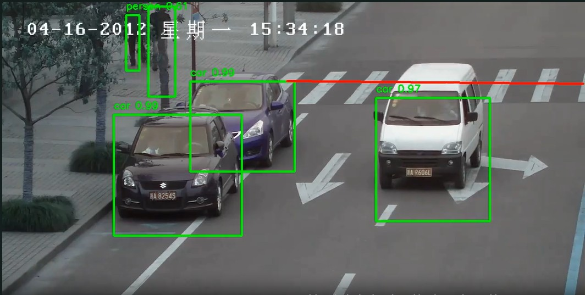

# TIntelliTraffic: Signal Violation Detection System

<br>



## INTRO

This software serves as a valuable tool for practicing the development of a system from the ground up. By engaging with it, you'll enhance your understanding of system development and its essential structure. Furthermore, it offers a great opportunity to explore computer vision, design graphical user interfaces (GUIs) using the Python library Tkinter, and grasp the foundational concepts of OpenCV. Embracing these skills will significantly contribute to your growth as a developer.

## Table of content

- [Introduction](#introduction)
- [Objectives](#objectives)
- [Quick Starting the project](#quick-starting-the-project)
- [Contributing](#contributing)
- [Links and References](#links-and-references)
- [Author](#author)
- [Licensing](#licensing)

## Introduction

As urban areas continue to experience an increasing number of vehicles, the issue of traffic congestion and violations has become more pressing in Bangladesh and globally. This surge in traffic can lead to property damage and, more importantly, pose risks to public safety through accidents. To address this critical situation and mitigate potential consequences, the implementation of advanced traffic violation detection systems is essential.

These systems are designed to uphold traffic regulations consistently and identify those who fail to comply. By focusing on real-time monitoring, authorities can effectively oversee road safety, ensuring that traffic enforcers can implement regulations accurately and efficiently.

The proposed traffic violation detection system can identify infractions, such as running red lights, in real-time. Additionally, a user-friendly graphical interface will facilitate ease of operation, allowing users to monitor traffic effectively and respond swiftly to any violations. This innovative approach will enhance road safety and contribute to a more orderly traffic environment.

## Objectives

The aim of this project is to create a system that automates the detection of traffic signal violations, making it easier for the traffic police department to monitor road safety. I understand how crucial it is for everyone to feel safe on the streets, and my goal is to empower the authorities to respond quickly and effectively to violations. By focusing on accurately detecting and tracking vehicles and their movements, I can help enhance my community's safety and well-being.

## Quick starting the project

### Requirements

- **Anaconda** installed on your system.
- A virtual environment set up with the required dependencies.
- Basic system configurations for running convolutional models.

---

### Steps to Run the Application

#### Option 1: Using Anaconda Prompt

1. **Open Anaconda Prompt**.
2. Navigate to the project directory:
   ```
   cd /path/to/project/directory
   ```
3. **Activate the Virtual Environment**:
   ```
   conda activate <virtual_environment_name>
   ```
4. Run the application:
   ```
   python Project-GUI.py
   ```
5. **Loading Weights**:
   - Wait for the convolutional weights to load (this may take some time depending on your system configuration).
6. The GUI will open automatically.
7. **Select Video**:
   - Choose a video file from your system to load a preview.
8. **Set ROI**:
   - Select the Region of Interest for detection.
9. Detection will start automatically.
   - Note: This is a slow process, especially on low-end systems.
10. **Exit**:
    - You can press `q` to stop the detection process.
11. **Output**:
    - Detected vehicles and the output video are saved in the project directory.

---

#### Option 2: Using Anaconda Navigator and Spyder

1. **Open Anaconda Navigator**.
2. Select and activate the virtual environment:
   - Locate and launch the environment for the project.
3. **Launch Spyder**:
   - Within the virtual environment, launch the Spyder IDE.
4. Set the project directory:
   - Use Spyder's file explorer to navigate to and select the project directory.
5. Run the application:
   ```
   python Project-GUI.py
   ```
6. Follow the same steps as outlined in Option 1 for GUI operations.

---

### Notes

- The convolutional model may take time to load due to system performance constraints.
- The output video and detected objects are saved automatically in the project directory.
- Pressing `q` allows you to exit the detection process at any time.

## Contributing

The primary reason is to empower everyone to dive in and contribute to my project. If you're interested in making a contribution, simply fork the repository and create a feature branch. I warmly welcome your pull requests!

## References

- G. Ou, Y. Gao and Y. Liu, "Real TimeVehicularTrafficViolationDetectioninTrafficMonitorin gStream," in 2012 IEEE/WIC/ACM , Beijing, China , 2012.
- X. Wang, L.-M. Meng, B. Zhang, J. Lu and K.-L.Du, "A Video-based Traffic Violation Detection System," in MEC, Shenyang, China, 2013.
- Joseph Redmon and Ali Farhadi, "YOLOv3: An Incremental Improvement".
- https://machinelearningmastery.com/how-to-perform-object-detection-with-yolov3-in-keras

## Licensing

The code in this project is licensed under GNU GPLv3 license.
